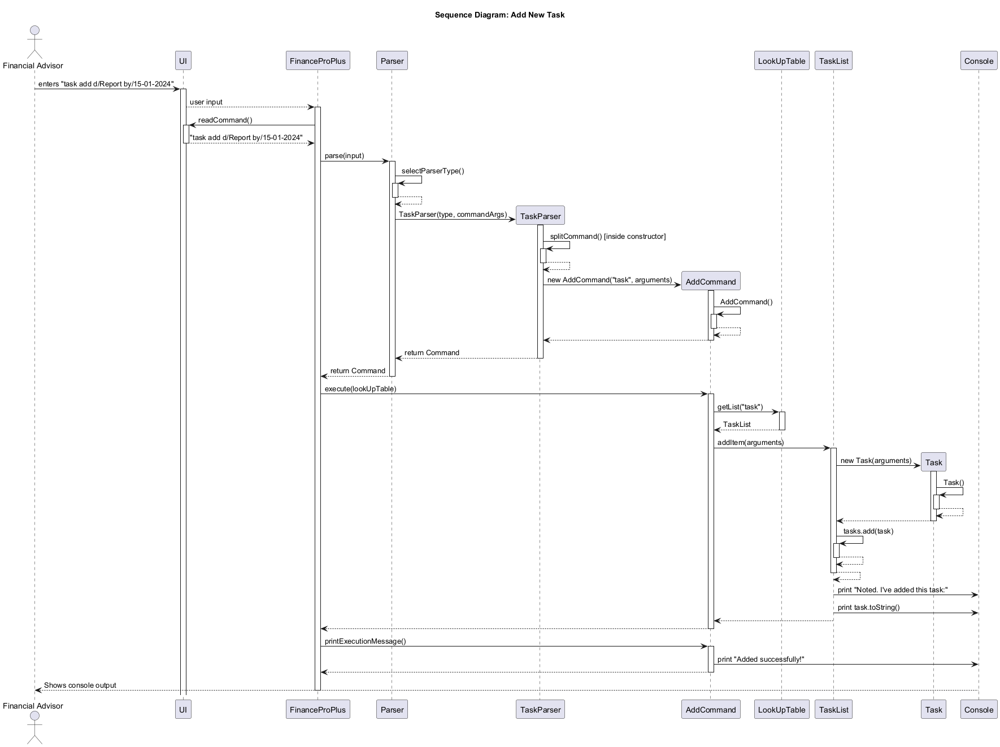

# Developer Guide

## Acknowledgements
This was heavily inspired by the AB3 reference DG found [here](https://github.com/se-edu/addressbook-level3/blob/master/docs/DeveloperGuide.md)

{list here sources of all reused/adapted ideas, code, documentation, and third-party libraries -- include links to the original source as well}

## Design & implementation
### Architecture

Here is a quick Overview of Main Components and how they interact with each other:

#### Main Components of the architecture
`Main` is in charge of the app launch and shut down. 
* At app launch, it initializes all other components.
* At shutdown, it shuts down the other components and invoked the java garbage collector where necessary

The App is consisted of the following four components:
* UI: The UI of the app
* Storage: Holds the Data of the App in Memory
* Parser: Finds the appropriate command and returns it to UI
* Commons: Consists of various classes that interact with other components
* LookUpTable: Consists a Look Up Table of various lists that store data
* Command: The command executer
### LookUpTable Component
API: [LookUpTable](./seedu/duke/container/LookUpTable.java)

In the LookUptable Component,
* It stores the various lists(ClientList,PolicyList,MeetingList,UserList) that implements the ListContainer Interface.
* Once instantiated, the constructor creates the list objects and stores it as a Hashmap with the appropriate key-value pairs
* The LookUpTable is composed of the lists. If deleted, the list objects will be destroyed

### Client Features

When a command with the prefix "client" is invoked by the user, here is a sequence diagram depicting the overall flow of the program.

To explain  an example of the command. The user(Financial Advisor), first issues a command, this command is passed into the UI. Class, the UI calls the parse command to pass the data into an instantiated parser for processing.
In the parser, it then further breaks it down into respective child classes, in this case, it is the ClientParser Child class. This class splits the processed string into further substrings and then calls the constructor for AddCommand. AddCommand calls itself to instantiate some methods
and hands back the control signal to Client Parser. ClientParser hands back signal to Parser and Parser hands back signal to UI. UI then calls the execute method from Add Command. Add Command calls Client List to addItem.
In the Additem function it creates a new Client Object. In the Client Object Constructor it does the verification and instantiates the attributes. The client object then returns the control signal back to ClientList.
ClientList then does a callback method AddClient to add the client into the clientlist object  and then the additem callback is finished. ClientList then hands back control to Add Command and Add Command adds gives back the control to UI.
UI then calls the method printExecutionMessage() to AddCommand and AddCommand returns control back to UI with data. UI then displays the success message to the user.

### Task Management Feature

The Task Management feature allows financial advisors to create and manage standalone tasks with due dates. This feature enables users to track action items, deadlines, and follow-ups independently of clients or policies, providing a comprehensive task management system within FinanceProPlus.

#### Implementation

The task management feature is implemented through several key components that work together to parse user input, validate task details, and persist task data. The implementation follows the existing architecture pattern established for other entities (clients, policies, meetings) in the system.

##### Architecture-Level Design

At the architecture level, the task feature integrates seamlessly with the existing components:

1. UI Component: Receives the user's task command (e.g., task add d/Report by/15-01-2024)
2. Parser Component: Routes the command to TaskParser, which interprets the command subtype and extracts arguments
3. Command Component: Creates and executes an AddCommand with the task subtype
4. LookUpTable Component: Retrieves the appropriate TaskList to handle the operation
5. Model Component: Task objects encapsulate task data including description and due date

##### Task Creation Process

When a user creates a new task, the following sequence of operations occurs:

### List Features

## Product scope
### Target user profile

{Describe the target user profile}

### Value proposition

{Describe the value proposition: what problem does it solve?}

## User Stories

|Version| As a ... | I want to ... | So that I can ...|
|--------|----------|---------------|------------------|
|v1.0|new user|see usage instructions|refer to them when I forget how to use the application|
|v2.0|user|find a to-do item by name|locate a to-do without having to go through the entire list|

## Non-Functional Requirements

{Give non-functional requirements}

## Glossary

* *glossary item* - Definition

## Instructions for manual testing

{Give instructions on how to do a manual product testing e.g., how to load sample data to be used for testing}
