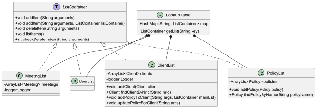
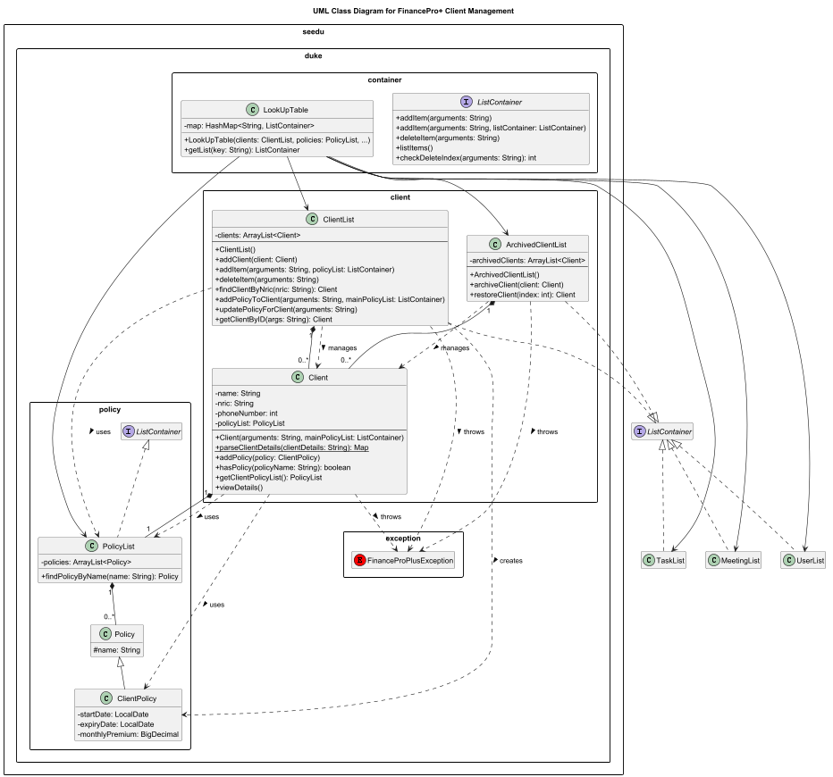

# Developer Guide

## Acknowledgements
This was heavily inspired by the AB3 reference DG found [here](https://github.com/se-edu/addressbook-level3/blob/master/docs/DeveloperGuide.md)

{list here sources of all reused/adapted ideas, code, documentation, and third-party libraries -- include links to the original source as well}

## Design & implementation
### Architecture

Here is a quick Overview of Main Components and how they interact with each other:

#### Main Components of the architecture
`Main` is in charge of the app launch and shut down. 
* At app launch, it initializes all other components.
* At shutdown, it shuts down the other components and invoked the java garbage collector where necessary

The App is consisted of the following four components:
* UI: The UI of the app
* Storage: Holds the Data of the App in Memory
* Parser: Finds the appropriate command and returns it to UI
* Commons: Consists of various classes that interact with other components
* LookUpTable: Consists a Look Up Table of various lists that store data
* Command: The command executer
### LookUpTable Component

API: [LookUpTable](./seedu/duke/container/LookUpTable.java)

The components`[meeting, client, policy, user]` is built around the ListContainer interface, which provides a powerful abstraction for any class that manages a collection of items. This design promotes polymorphism and loose coupling, allowing different parts of the application to interact with various lists (clients, policies, etc.) in a standardized way.
ListContainer Interface: Defines the essential methods that any list-like data structure in the application must implement:
* `addItem(...)`: To add a new item.
* `deleteItem(...)`: To remove an item.
* `listItems()`: To display all items.
* `checkDeleteIndex(...)`: To validate an index for deletion.

In the LookUptable Component,
* It stores the various lists(ClientList,PolicyList,MeetingList,UserList) that implements the ListContainer Interface.
* Once instantiated, the constructor creates the list objects and stores it as a Hashmap with the appropriate key-value pairs
* The LookUpTable is composed of the lists. If deleted, the list objects will be destroyed

### Client Features
To begin, here is a high level Class Diagram of Clients and its interaction with other classes:

The Client Management component is the core of handling customer data within the application. It is responsible for creating, storing, retrieving, updating, and archiving client profiles. The design separates active clients from archived clients and uses a common interface (ListContainer) to ensure consistent handling of data collections throughout the application.

The primary classes in this component are:
* Client: The data model representing an individual client.
* ClientList: The manager for all active clients.
* ArchivedClientList: A specialized manager for inactive/archived clients.
* ListContainer: An interface defining a standard contract for list operations.
#### 2. Class Breakdown
   **Responsibility:** Acts as the data model for a single client. It encapsulates all information related to a client, including their personal details and associated insurance policies.
   
**Key Attributes:** 
   * `name, nric, phoneNumber`: Basic personal information.
   * `policyList`: A PolicyList object that holds all policies associated with this specific client. This is a composition relationship—a Client has a PolicyList.
   * `Key Behaviors`:
     - The constructor `Client(String arguments, ...) ` is responsible for parsing a formatted string to populate the client's details.
     - `addPolicy()` allows adding a new ClientPolicy to its internal policyList.
     - `toStorageString()` and `toCSVRow()` provide standardized ways to serialize client data for file storage and export.
#### ClientList
   **Responsibility**: Manages the collection of all active clients. It serves as the primary entry point for all operations on active clients, such as adding, searching, and updating them.

   **Relationship**: Implements the ListContainer interface.

   **Key Attributes**:
   `clients`: An ArrayList<Client> to store the active client objects.
   
**Key Behaviors**:

   * `addItem(arguments, policyList)`: Parses user input, validates that the client doesn't already exist (by NRIC), and creates and adds a new Client object.
   * `deleteItem(arguments)`: Removes a client from the active list based on their index. This client would typically be moved to the ArchivedClientList by a higher-level command handler.
   * `findClientByNric(nric)`: A crucial lookup method to retrieve a specific client.
   * `addPolicyToClient(...)` & `updatePolicyForClient(...)`: Contains the business logic to modify a client's policy details. It first finds the client and then delegates the policy update to the Client and ClientPolicy objects.
#### Archived ClientList
**Responsibility**: Manages clients who are no longer active. It provides a limited, more secure set of interactions compared to ClientList.
   **Relationship**: Implements the ListContainer interface.
   **Key Behaviors**:
   * **Distinct Operations**: Its main public methods are archiveClient(Client) and restoreClient(index).
   * **Restricted Operations**: To prevent accidental modification, standard ListContainer methods like addItem() and deleteItem() are overridden to throw a FinanceProPlusException. This is an important design choice, enforcing the rule that clients can only enter this list via archiving and leave via restoring.
   * **Responsibility**: Acts as a centralized registry or service locator for all major ListContainer instances in the application (clients, policies, meetings, etc.).
   * **Relationship**: It holds a HashMap mapping string keys (e.g., "client", "policy") to their corresponding ListContainer objects. 
   * **Usage**: Instead of passing multiple list objects through many method calls, a command can simply request the required list from the LookUpTable using a key (e.g., lookupTable.getList("client")).
### 3. Key Interactions and Data Flow
   **Client Creation**: A command parses user input and calls ClientList.addItem(). ClientList creates a new Client instance, which in turn parses the detailed arguments. The main PolicyList is passed during creation for validation purposes.
   
**Archiving a Client**: A client object is removed from the ClientList and passed to the ArchivedClientList.archiveClient() method.
   
**Adding a Policy**: A command calls ClientList.addPolicyToClient(). ClientList finds the client by NRIC, validates the new policy against the main PolicyList, creates a ClientPolicy instance, and then calls the client.addPolicy() method to add it to the client's internal list.
### 4. Error Handling
   **FinanceProPlusException**: This custom exception is used consistently across all classes to signal errors related to business logic (e.g., duplicate client, invalid index) or data validation (e.g., malformed input, missing fields). This standardizes error handling throughout the component.
When a command with the prefix "client" is invoked by the user, here is a sequence diagram depicting the overall flow of the program.

To explain  an example of the command. The user(Financial Advisor), first issues a command, this command is passed into the UI. Class, the UI calls the parse command to pass the data into an instantiated parser for processing.

In the parser, it then further breaks it down into respective child classes, in this case, it is the ClientParser Child class. This class splits the processed string into further substrings and then calls the constructor for AddCommand. AddCommand calls itself to instantiate some methods
and hands back the control signal to Client Parser. ClientParser hands back signal to Parser and Parser hands back signal to UI. UI then calls the execute method from Add Command. Add Command calls Client List to addItem.

In the Additem function it creates a new Client Object. In the Client Object Constructor it does the verification and instantiates the attributes. The client object then returns the control signal back to ClientList.
ClientList then does a callback method AddClient to add the client into the clientlist object  and then the additem callback is finished.

ClientList then hands back control to Add Command and Add Command adds gives back the control to UI.
UI then calls the method printExecutionMessage() to AddCommand and AddCommand returns control back to UI with data. UI then displays the success message to the user.
### List Features

## Product scope
### Target user profile

{Describe the target user profile}

### Value proposition

{Describe the value proposition: what problem does it solve?}

## User Stories

|Version| As a ... | I want to ... | So that I can ...|
|--------|----------|---------------|------------------|
|v1.0|new user|see usage instructions|refer to them when I forget how to use the application|
|v2.0|user|find a to-do item by name|locate a to-do without having to go through the entire list|

## Non-Functional Requirements

{Give non-functional requirements}

## Glossary

* *glossary item* - Definition

## Instructions for manual testing

{Give instructions on how to do a manual product testing e.g., how to load sample data to be used for testing}
